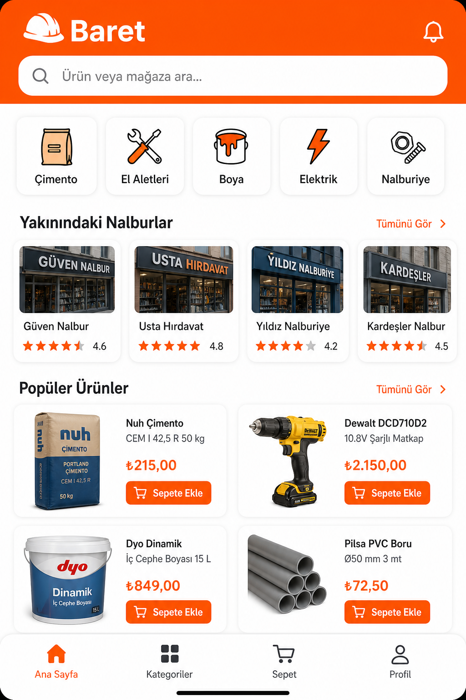
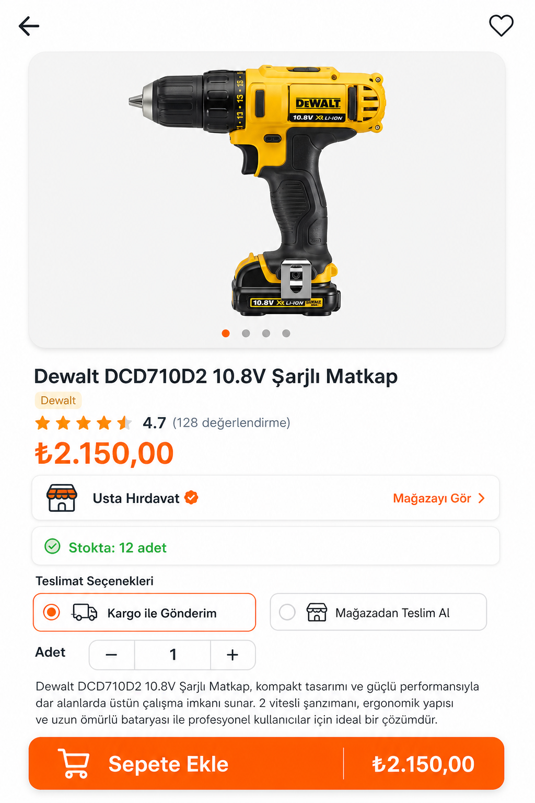
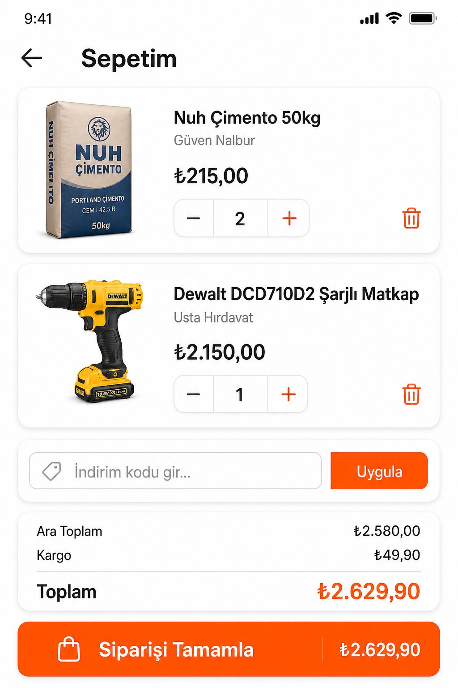

# 🪖 Baret

Baret, inşaat mühendisleri ile nalburları tek bir mobil platformda buluşturan çok satıcılı (multi-vendor) bir mobil pazaryeri uygulamasıdır.

Bu proje, Trunçgil Teknoloji Yaz Staj Programı kapsamında geliştirilmektedir.

---

# Projenin Amacı

İnşaat sektöründe malzeme tedarik sürecini dijitalleştirerek;

- ürün aramayı kolaylaştırmak,
- fiyat karşılaştırmasını mümkün kılmak,
- yerel nalburların dijitalleşmesini sağlamak,
- mühendislerin ihtiyaç duydukları ürünlere daha hızlı ulaşmasını hedeflemektedir.

---

# Kullanılacak Teknolojiler

- React Native (Expo)
- TypeScript
- Supabase
- PostgreSQL
- React Navigation
- NativeWind
- Context API

---

# Proje Yapısı

Bu repo geliştirme sürecinde aşağıdaki prensiplere göre yönetilmektedir.

- GitHub Issues
- GitHub Milestones
- GitHub Projects (Kanban)
- Feature Branch Workflow
- Pull Request Review
- Günlük Commit Takibi

---

# Dokümantasyon

Projenin ayrıntılı geliştirme planı aşağıdaki dosyada bulunmaktadır.

- implementation_plan.md

---

# UI Mockups (Alıcı Akışı)

Faz 1 kapsamında alıcı tarafının temel ekranları AI destekli olarak tasarlandı. Görseller `assets/mockups/` klasöründe saklanmaktadır.

## Tasarım Dili

| Öğe | Değer |
|-----|-------|
| Birincil renk | Safety Orange `#FF6B00` |
| Arka plan | Beyaz / açık gri |
| Kart stili | Yuvarlak köşeler, hafif gölge |
| Tipografi | Modern sans-serif |
| Navigasyon | Alt tab bar (Ana Sayfa, Kategoriler, Sepet, Profil) |

## Ana Sayfa

Arama çubuğu, kategori chip'leri, yakındaki nalburlar ve popüler ürünler grid'i.



## Ürün Detay

Ürün galerisi, fiyat, mağaza bilgisi, stok durumu, teslimat seçenekleri ve sepete ekleme butonu.



## Sepet

Sepet kalemleri, adet seçici, indirim kodu alanı, sipariş özeti ve siparişi tamamla butonu.



---

# Faz 1 Teslim Edilenler

Faz 1 (Proje Hazırlığı, Analiz ve Tasarım) kapsamında aşağıdaki çıktılar tamamlandı:

| Çıktı | Dosya / Konum | Açıklama |
|-------|---------------|----------|
| Geliştirme planı | `implementation_plan.md` | 4 fazlı 20 günlük yol haritası, teknik mimari, ekran envanteri |
| Veritabanı şeması | `database.sql` | 5 tablo, ENUM tipleri, FK ilişkileri, RLS politikaları, trigger'lar |
| UI mockup'ları | `assets/mockups/` | Ana Sayfa, Ürün Detay, Sepet ekranları |
| Proje vitrini | `README.md` | Mockup sergileme, tech stack, proje durumu |

---

# Supabase Kurulumu (Gün 8)

## 1. Ortam değişkenleri

```bash
cp .env.example .env
```

`.env` dosyasını Supabase Dashboard → **Project Settings → API** değerleriyle doldur:

- `EXPO_PUBLIC_SUPABASE_URL`
- `EXPO_PUBLIC_SUPABASE_ANON_KEY`

> `.env` git'e eklenmez. Repoda yalnızca `.env.example` tutulur.

## 2. Veritabanı şemasını uygula

1. Supabase Dashboard → **SQL Editor**
2. Repo kökündeki `database.sql` dosyasının içeriğini yapıştır
3. **Run** ile çalıştır

Şema şunları oluşturur:

| Tür | İçerik |
|-----|--------|
| ENUM | `user_role`, `order_status`, `delivery_option` |
| Tablolar | `users`, `stores`, `products`, `orders`, `reviews` |
| Trigger | `set_updated_at`, `handle_new_user` |
| RLS | Rol bazlı erişim politikaları |

## 3. Uygulama tarafı

| Dosya | Görev |
|-------|-------|
| `src/services/supabase.ts` | Typed Supabase client |
| `src/types/database.ts` | Tablo + ENUM TypeScript tipleri |
| `src/constants/enums.ts` | ENUM listeleri ve Türkçe etiketler |

Doğrulama: SQL Editor'de tablolar görünüyor mu; uygulamada `.env` doluysa client ayağa kalkıyor mu.

> **Güvenlik referansı:** Trigger, yardımcı fonksiyon ve RLS politika açıklamaları için bkz. [`docs/rls-and-triggers.md`](docs/rls-and-triggers.md).

---

# Durum

✅ **Faz 3 — Gün 12/16 tamamlandı** | Satıcı mağaza + ürün CRUD hazır. **Sonraki: Gün 13** ürün görseli (Supabase Storage).