# 🪖 Baret

Baret, inşaat mühendisleri ile nalburları tek bir mobil platformda buluşturan çok satıcılı (multi-vendor) bir mobil pazaryeri uygulamasıdır.

Bu proje, Trunçgil Teknoloji Yaz Staj Programı kapsamında geliştirilmektedir.

---

# Projenin Amacı

İnşaat sektöründe malzeme tedarik sürecini dijitalleştirerek;

- ürün aramayı kolaylaştırmak,
- fiyat karşılaştırmasını mümkün kılmak,
- yerel nalburların dijitalleşmesini sağlamak,
- mühendislerin ihtiyaç duydukları ürünlere daha hızlı ulaşmasını hedeflemektedir.

---

# Kullanılacak Teknolojiler

- React Native (Expo)
- TypeScript
- Supabase
- PostgreSQL
- React Navigation
- NativeWind
- Context API

---

# Proje Yapısı

Bu repo geliştirme sürecinde aşağıdaki prensiplere göre yönetilmektedir.

- GitHub Issues
- GitHub Milestones
- GitHub Projects (Kanban)
- Feature Branch Workflow
- Pull Request Review
- Günlük Commit Takibi

---

# Dokümantasyon

Projenin ayrıntılı geliştirme planı aşağıdaki dosyada bulunmaktadır.

- implementation_plan.md

---

# UI Mockups (Alıcı Akışı)

Faz 1 kapsamında alıcı tarafının temel ekranları AI destekli olarak tasarlandı. Görseller `assets/mockups/` klasöründe saklanmaktadır.

## Tasarım Dili

| Öğe | Değer |
|-----|-------|
| Birincil renk | Safety Orange `#FF6B00` |
| Arka plan | Beyaz / açık gri |
| Kart stili | Yuvarlak köşeler, hafif gölge |
| Tipografi | Modern sans-serif |
| Navigasyon | Alt tab bar (Ana Sayfa, Kategoriler, Sepet, Profil) |

## Ana Sayfa

Arama çubuğu, kategori chip'leri, yakındaki nalburlar ve popüler ürünler grid'i.

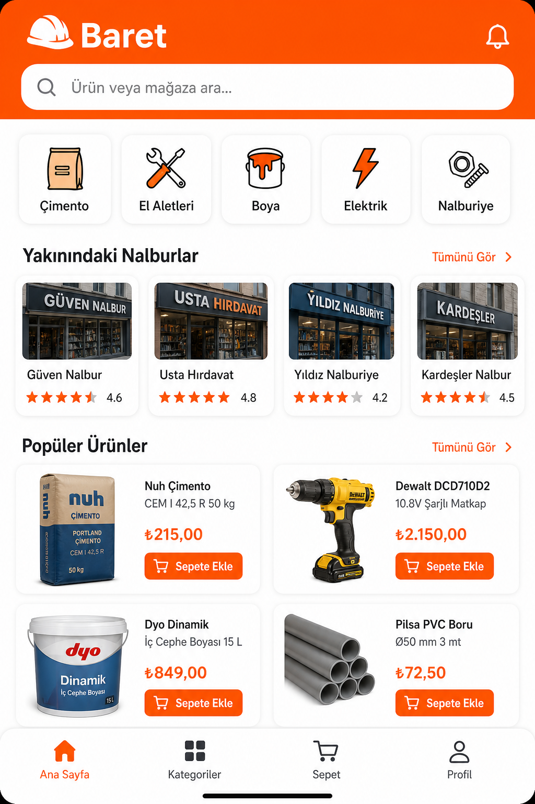

## Ürün Detay

Ürün galerisi, fiyat, mağaza bilgisi, stok durumu, teslimat seçenekleri ve sepete ekleme butonu.

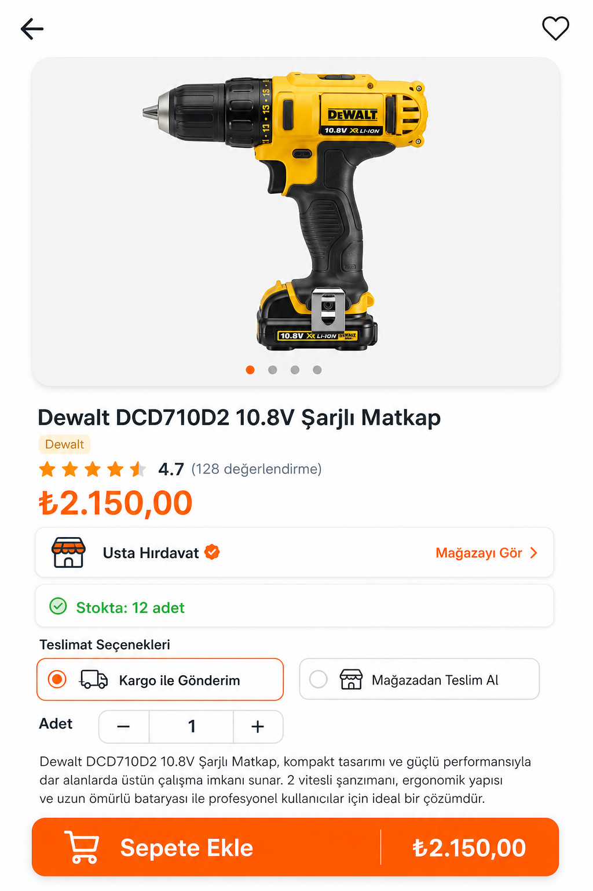

## Sepet

Sepet kalemleri, adet seçici, indirim kodu alanı, sipariş özeti ve siparişi tamamla butonu.

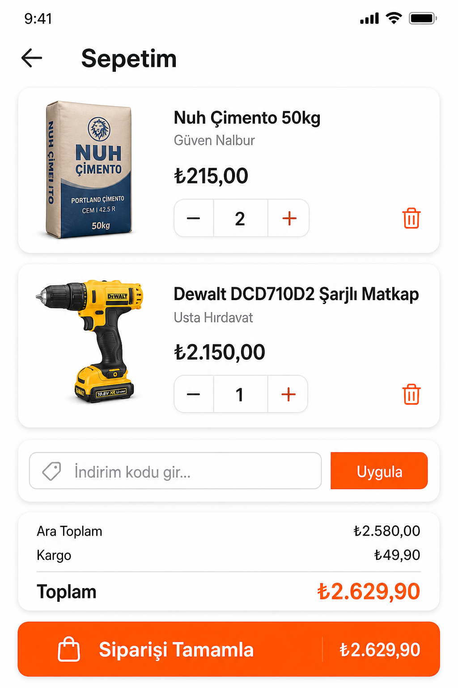

---

# Cihaz Ekran Görüntüleri (Çalışan Uygulama)

Expo Go üzerinde alınan gerçek ekranlar (auth + satıcı paneli).

### Auth (Gün 11)

| Ekran | Dosya |
|-------|--------|
| Giriş | `assets/screenshots/auth-login.png` |
| Rol seçimi | `assets/screenshots/auth-role-select.png` |
| Kayıt | `assets/screenshots/auth-register.png` |

### Satıcı — ürün listesi (Gün 12–13)

Satıcı hesabıyla giriş sonrası **Ürünlerim**: ürün kartları (ad, fiyat, stok, teslimat, düzenle/sil). Görsel yükleme için Storage bucket + policy gerekir; Android’de galeri URI’leri `expo-file-system` ile okunur.

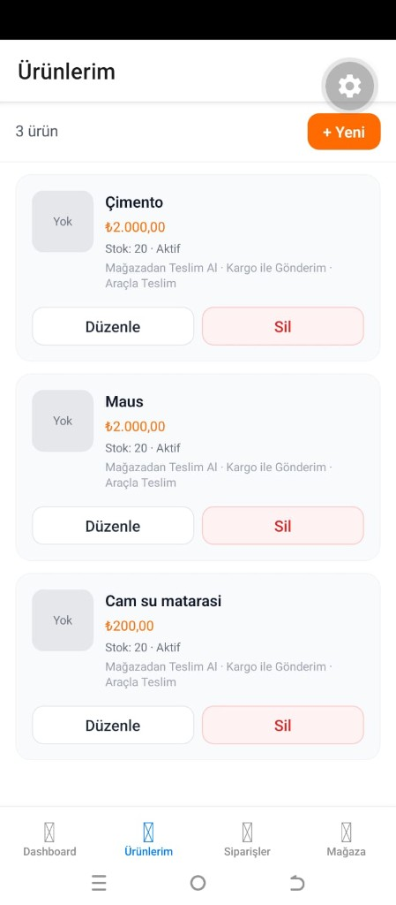

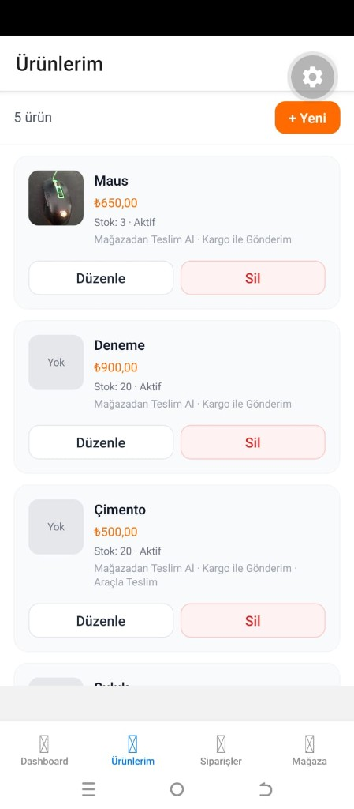

### Alıcı — ana sayfa katalog (Gün 14)

Alıcı Ana Sayfa: onaylı mağazaların aktif ürünleri; arama, kategori chip’leri, şehir/ilçe, fiyat aralığı ve teslimat filtreleri (`src/services/catalog.ts`, `HomeScreen`). Onaysız mağaza veya eşleşmeyen filtrede boş durum gösterilir.

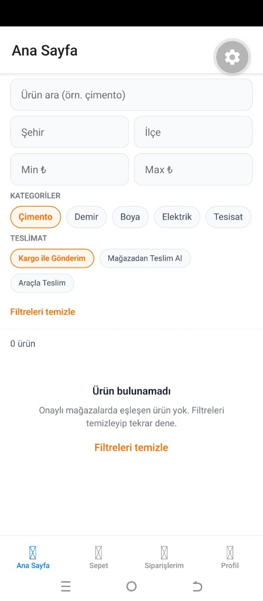

### Alıcı — ürün detay + sepet (Gün 15)

Mağaza `is_approved = true` olduktan sonra alıcı katalogda satıcı ürünlerini görür; ürün detayında stok/adet seçimi, sepete ekleme (badge), sepet satır toplamı ve cihaz içi kalıcılık (`CartContext` + AsyncStorage). Checkout → Gün 16 bölümü.

| Ekran | Dosya |
|-------|--------|
| Onaylı katalog (5 ürün) | `assets/screenshots/buyer-home-approved-catalog.png` |
| Ürün detay | `assets/screenshots/product-detail.png` |
| Sepete eklendi diyaloğu | `assets/screenshots/product-detail-add-to-cart.png` |
| Sepet | `assets/screenshots/cart-screen.png` |
| Mağaza onayı (eski SQL kanıtı; UI tercih edilir) | `assets/screenshots/store-approve-sql.png` |

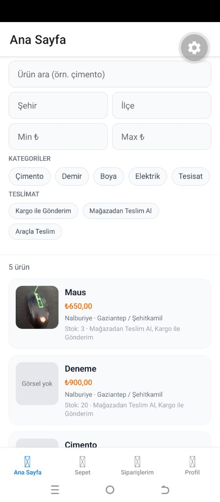

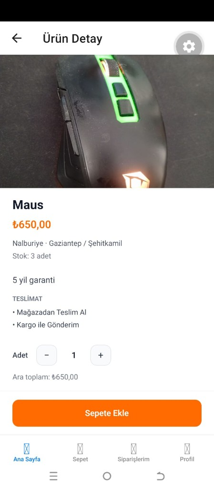

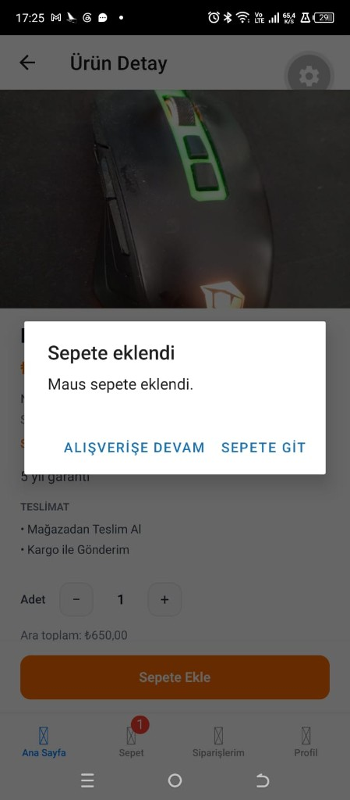

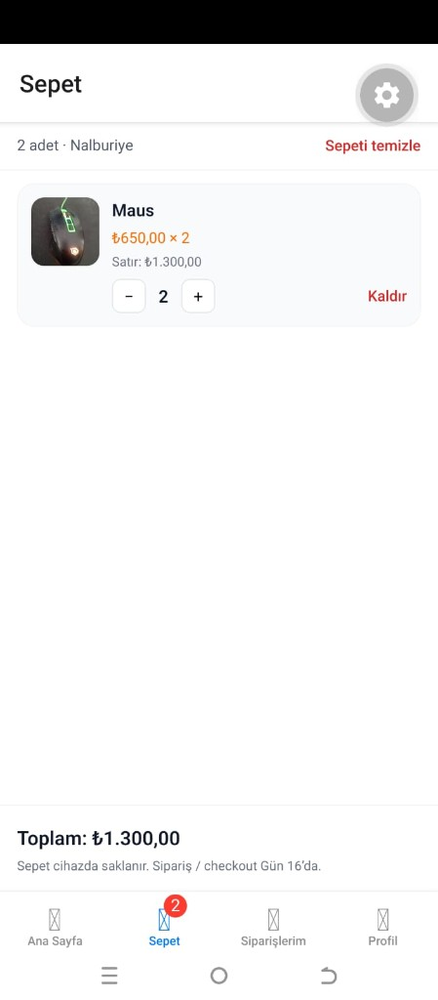

### Admin — mağaza onayı (Gün 17 lite)

Admin hesabı (`users.role = 'admin'`) ile giriş: ana panel (çıkış, menü), Satıcı Onayları (Bekleyen / Onaylı / Tümü, onayla / geri al / pasife al). SQL onayı artık zorunlu değil.

| Ekran | Dosya |
|-------|--------|
| Admin ana sayfa | `assets/screenshots/admin-home.png` |
| Onaylı mağazalar | `assets/screenshots/admin-seller-approvals-all.png` |
| Bekleyen (boş durum) | `assets/screenshots/admin-seller-approvals-pending.png` |

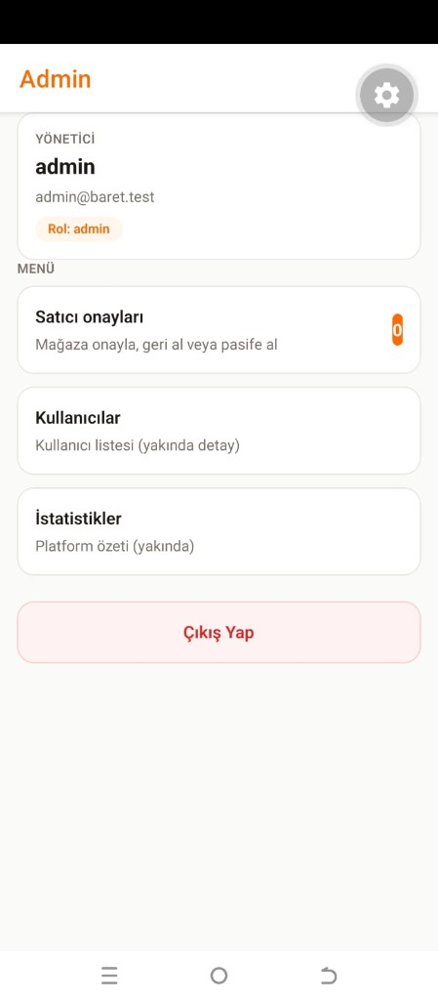

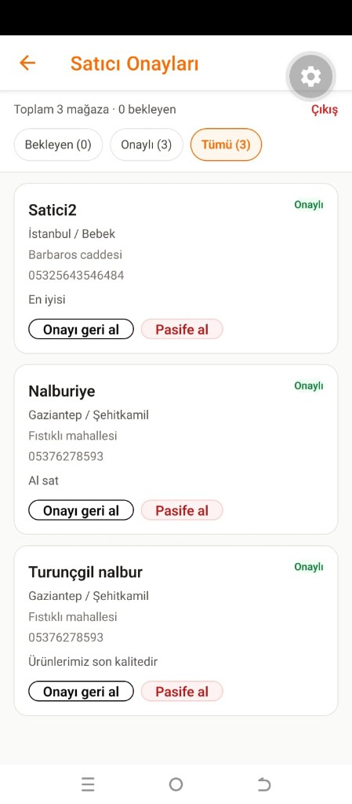

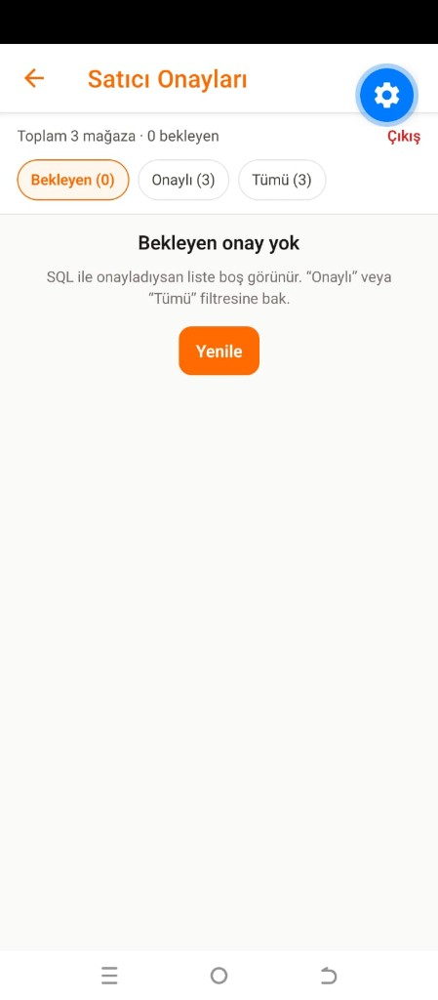

### Alıcı / satıcı — checkout & sipariş (Gün 16)

Sepet → Siparişe geç → teslimat + adres → `orders` kaydı; alıcı Siparişlerim (iptal); satıcı durum: Beklemede → Hazırlanıyor → Kargoda → Teslim Edildi. Stok trigger: `docs/order-stock-trigger.sql`.

| Ekran | Dosya |
|-------|--------|
| Sepet + Siparişe geç | `assets/screenshots/cart-checkout-cta.png` |
| Checkout | `assets/screenshots/checkout-screen.png` |
| Alıcı siparişler | `assets/screenshots/buyer-orders.png` |
| Satıcı — beklemede | `assets/screenshots/seller-orders-pending.png` |
| Satıcı — hazırlanıyor | `assets/screenshots/seller-orders-preparing.png` |
| Satıcı — kargoda | `assets/screenshots/seller-orders-shipped.png` |

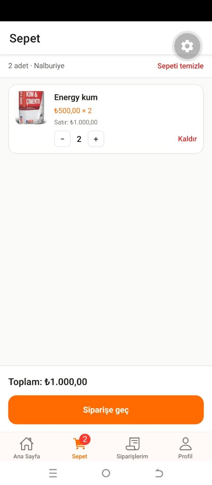

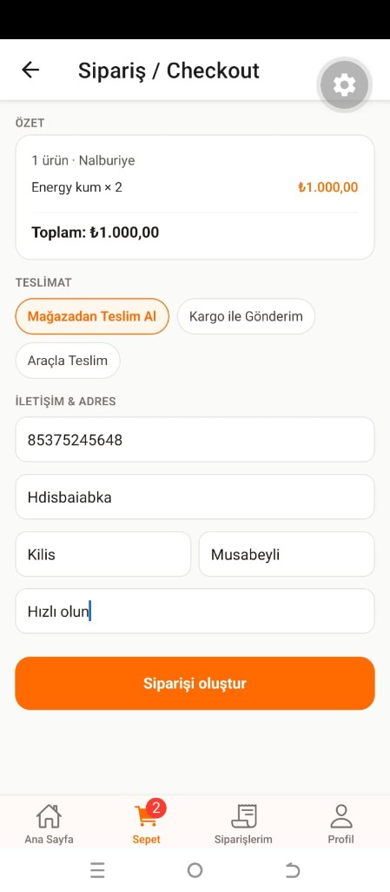

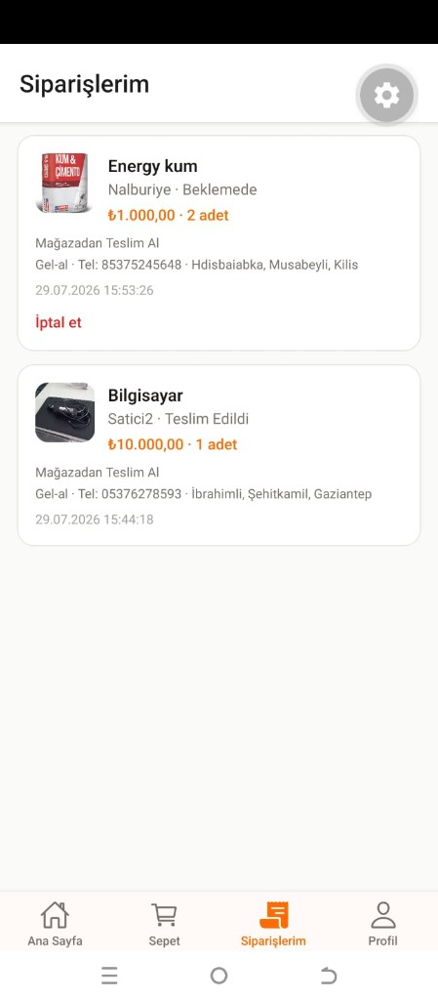

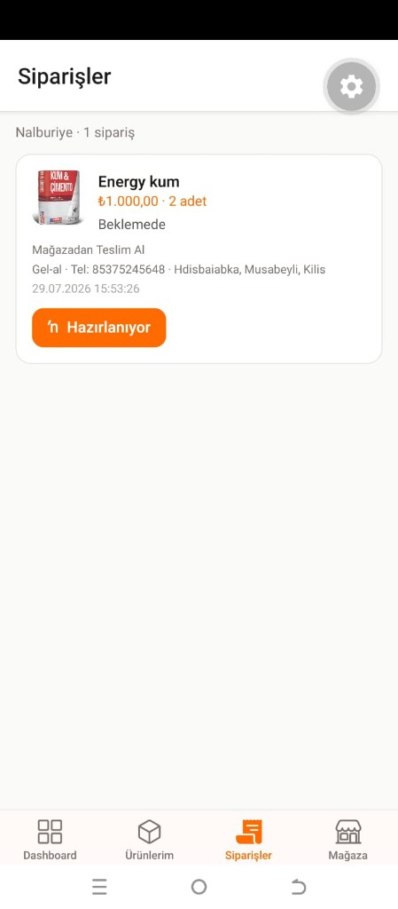

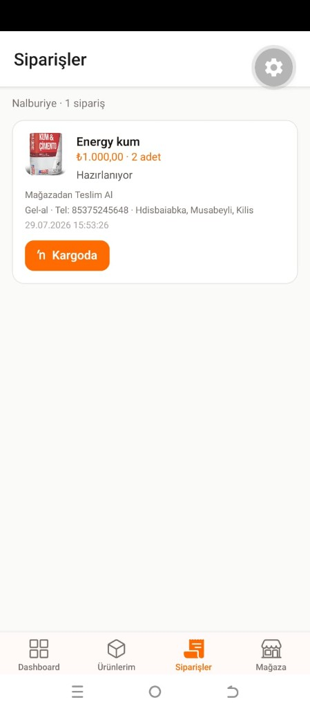

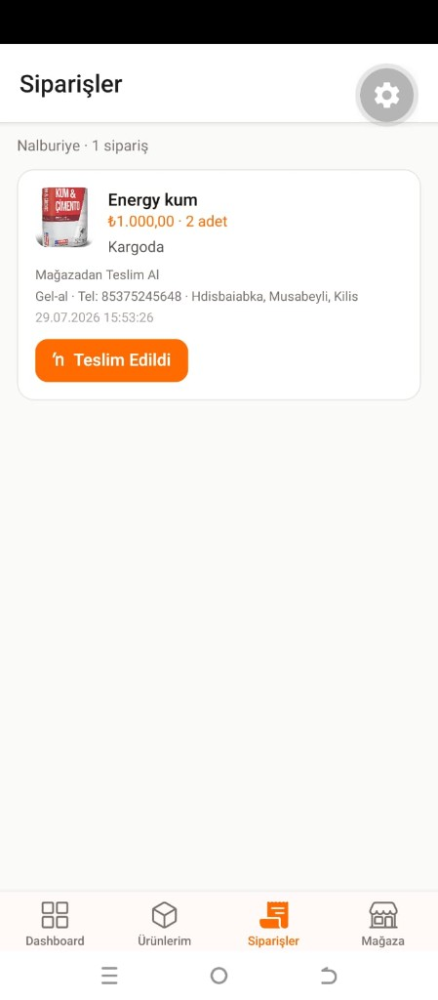

### Değerlendirme — yıldız + yorum (Gün 17)

Teslim edilen siparişte alıcı 1–5 yıldız + yorum bırakır; satıcı Dashboard’da ortalama ve son yorumları görür. Ürün detayda mağaza puanı listelenir.

| Ekran | Dosya |
|-------|--------|
| Alıcı — değerlendirme | `assets/screenshots/buyer-orders-reviews.png` |
| Satıcı dashboard (5★) | `assets/screenshots/seller-dashboard-reviews.png` |
| Satıcı dashboard (2★) | `assets/screenshots/seller-dashboard-reviews-low.png` |

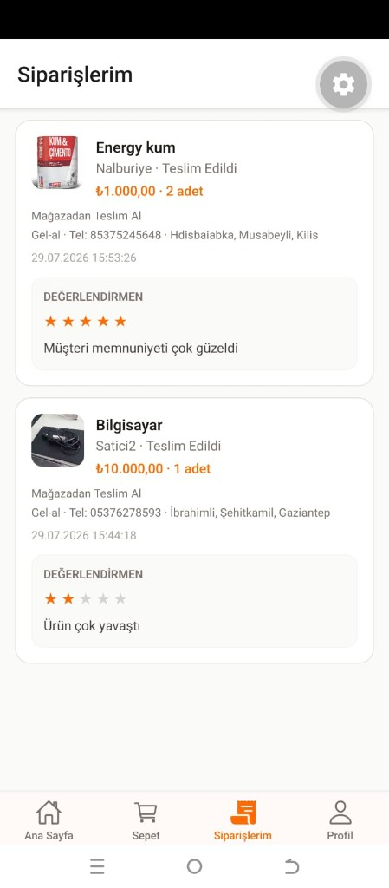

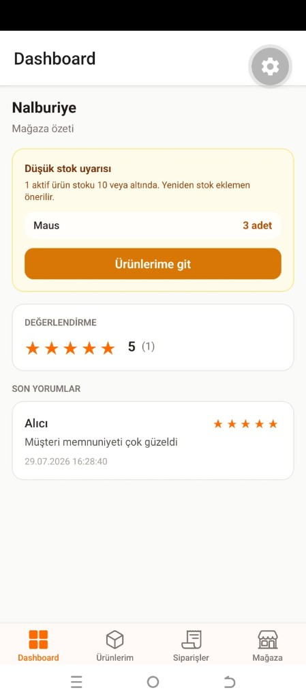

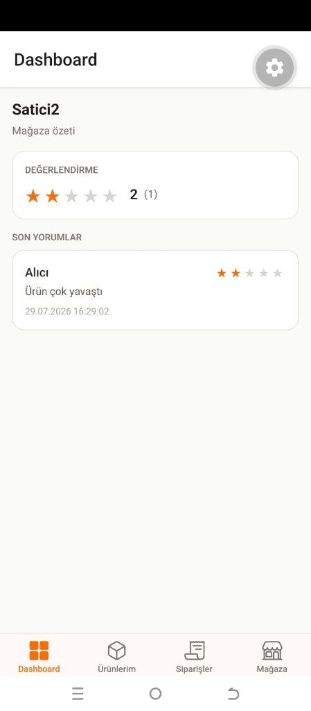

---

# Faz 1 Teslim Edilenler

Faz 1 (Proje Hazırlığı, Analiz ve Tasarım) kapsamında aşağıdaki çıktılar tamamlandı:

| Çıktı | Dosya / Konum | Açıklama |
|-------|---------------|----------|
| Geliştirme planı | `implementation_plan.md` | 4 fazlı 20 günlük yol haritası, teknik mimari, ekran envanteri |
| Veritabanı şeması | `database.sql` | 5 tablo, ENUM tipleri, FK ilişkileri, RLS politikaları, trigger'lar |
| UI mockup'ları | `assets/mockups/` | Ana Sayfa, Ürün Detay, Sepet ekranları |
| Proje vitrini | `README.md` | Mockup sergileme, tech stack, proje durumu |

---

# Supabase Kurulumu (Gün 8)

## 1. Ortam değişkenleri

```bash
cp .env.example .env
```

`.env` dosyasını Supabase Dashboard → **Project Settings → API** değerleriyle doldur:

- `EXPO_PUBLIC_SUPABASE_URL`
- `EXPO_PUBLIC_SUPABASE_ANON_KEY`

> `.env` git'e eklenmez. Repoda yalnızca `.env.example` tutulur.

## 2. Veritabanı şemasını uygula

1. Supabase Dashboard → **SQL Editor**
2. Repo kökündeki `database.sql` dosyasının içeriğini yapıştır
3. **Run** ile çalıştır

Şema şunları oluşturur:

| Tür | İçerik |
|-----|--------|
| ENUM | `user_role`, `order_status`, `delivery_option` |
| Tablolar | `users`, `stores`, `products`, `orders`, `reviews` |
| Trigger | `set_updated_at`, `handle_new_user` |
| RLS | Rol bazlı erişim politikaları |

## 3. Uygulama tarafı

| Dosya | Görev |
|-------|-------|
| `src/services/supabase.ts` | Typed Supabase client |
| `src/types/database.ts` | Tablo + ENUM TypeScript tipleri |
| `src/constants/enums.ts` | ENUM listeleri ve Türkçe etiketler |

Doğrulama: SQL Editor'de tablolar görünüyor mu; uygulamada `.env` doluysa client ayağa kalkıyor mu.

> **Güvenlik referansı:** Trigger, yardımcı fonksiyon ve RLS politika açıklamaları için bkz. [`docs/rls-and-triggers.md`](docs/rls-and-triggers.md).

## 4. Storage (ürün görselleri — Gün 13)

1. Dashboard → Storage → `product-images` bucket (public)
2. Policy SQL ve adımlar: [`docs/storage-setup.md`](docs/storage-setup.md)
3. Uygulama: `src/services/storage.ts` + ürün formunda galeri yükleme

---

# Durum

✅ **Faz 4 — Gün 17/20 tamamlandı** | Admin onay + değerlendirme (yıldız/yorum). **Sonraki: Gün 18** bug fix / UI polish.