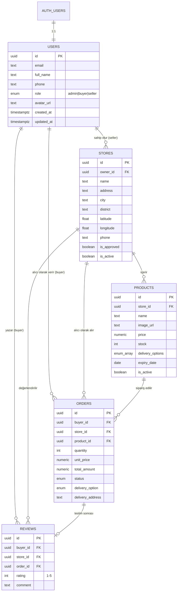
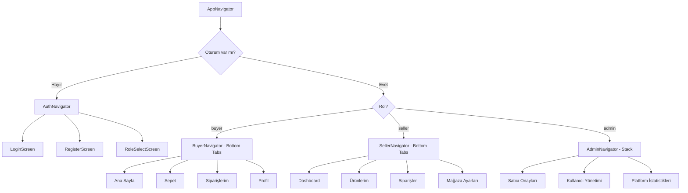
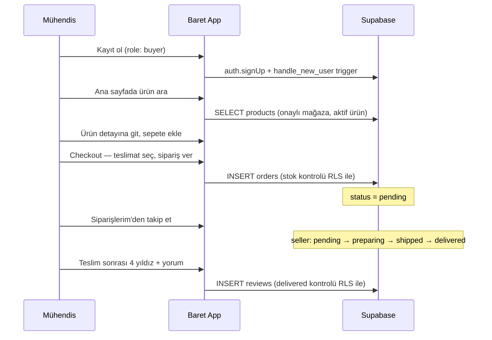
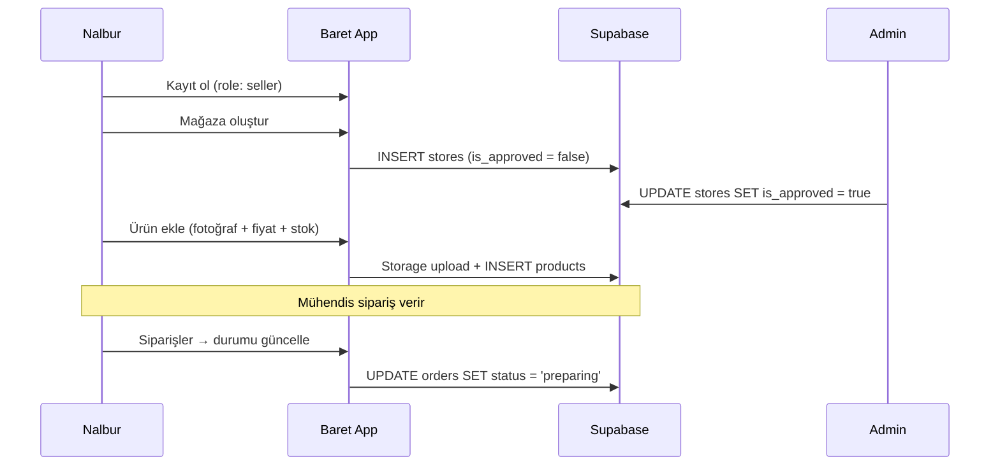
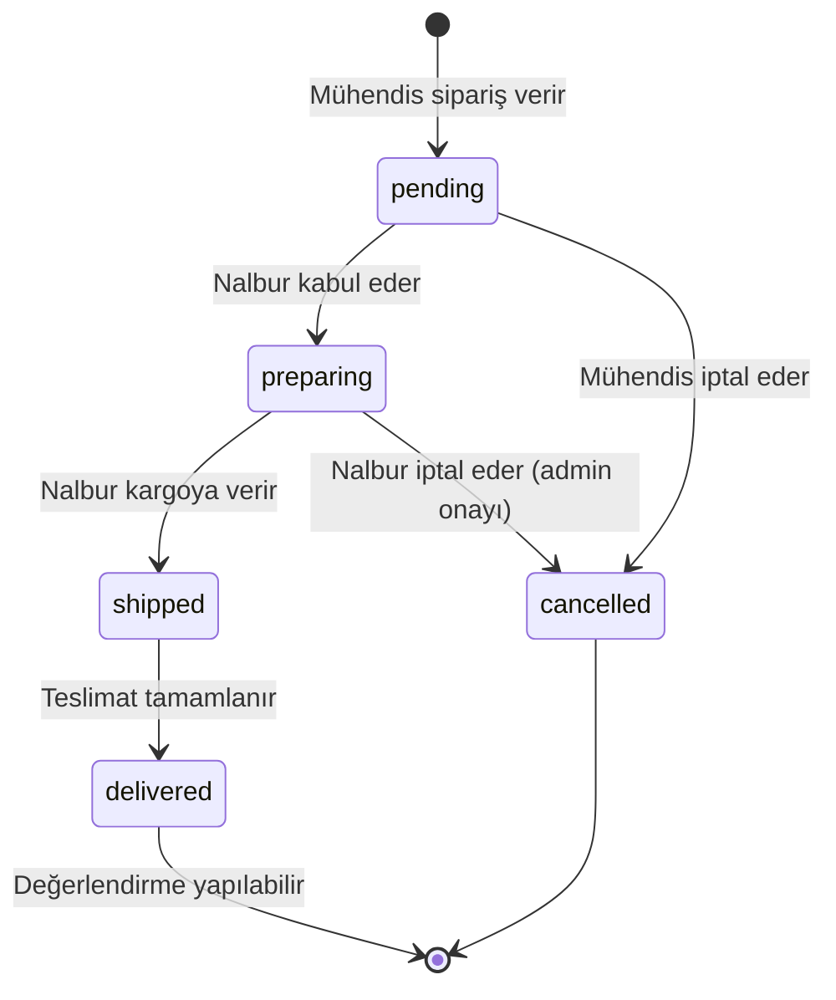

# Baret — İnşaat ve Nalbur Pazaryeri
## Kapsamlı Proje Dokümantasyonu & 20 Günlük Implementation Plan

> **Son güncelleme:** 20 Temmuz 2026 (Pazartesi)  
> **Proje durumu:** Faz 2 devam ediyor — Gün 7/11 (1 görev tamamlandı) | Sonraki: Gün 8 (Supabase)  
> **Repo:** [github.com/Faruk-T/baret](https://github.com/Faruk-T/baret)

Bu doküman, Baret projesini hiç bilmeyen bir geliştiricinin bile uçtan uca anlayabilmesi için hazırlanmış **tek kaynak (single source of truth)** dokümantasyondur. İş modeli, teknik mimari, veritabanı şeması, ekran envanteri, kullanıcı akışları, güvenlik kuralları ve gün gün geliştirme planı burada yer alır.

---

## İçindekiler

0. [4 Faz Özeti](#0-4-faz-özeti)
1. [Proje Özeti ve Vizyon](#1-proje-özeti-ve-vizyon)
2. [İş Modeli ve Gelir Yapısı](#2-iş-modeli-ve-gelir-yapısı)
3. [Kullanıcı Rolleri ve Yetkiler](#3-kullanıcı-rolleri-ve-yetkiler)
4. [Teknoloji Yığını (Tech Stack)](#4-teknoloji-yığını-tech-stack)
5. [Sistem Mimarisi](#5-sistem-mimarisi)
6. [Klasör Yapısı](#6-klasör-yapısı)
7. [Veritabanı Mimarisi](#7-veritabanı-mimarisi)
8. [Güvenlik: RLS Politikaları](#8-güvenlik-rls-politikaları)
9. [Supabase Storage Planı](#9-supabase-storage-planı)
10. [State Management (Context API)](#10-state-management-context-api)
11. [Navigasyon Mimarisi](#11-navigasyon-mimarisi)
12. [Ekran Envanteri](#12-ekran-envanteri)
13. [Kullanıcı Akışları](#13-kullanıcı-akışları)
14. [Servis Katmanı (API Fonksiyonları)](#14-servis-katmanı-api-fonksiyonları)
15. [Sipariş Yaşam Döngüsü](#15-sipariş-yaşam-döngüsü)
16. [Gelecek Modüller (RFQ & Komisyon)](#16-gelecek-modüller-rfq--komisyon)
17. [Ortam Değişkenleri ve Kurulum](#17-ortam-değişkenleri-ve-kurulum)
18. [Git İş Akışı ve Şirket Prosedürleri (Trunçgil Standartları)](#18-git-iş-akışı-ve-şirket-prosedürleri-trunçgil-standartları)
19. [Test Stratejisi](#19-test-stratejisi)
20. [20 Günlük Geliştirme Planı (4 Faz)](#20-20-günlük-geliştirme-planı-4-faz)
21. [Riskler ve Bağımlılıklar](#21-riskler-ve-bağımlılıklar)
22. [Teslim Kriterleri (Definition of Done)](#22-teslim-kriterleri-definition-of-done)

---

## 0. 4 Faz Özeti

Proje, **Trunçgil Teknoloji** staj prosedürüne uygun olarak **4 faza** ve toplam **20 iş gününe** bölünmüştür. Faz 1, proje hazırlığının kritikliği nedeniyle **6 gün/madde**den oluşur; kalan 14 gün diğer 3 faza dağıtılmıştır. Her fazın amacı, teslim edilecekler ve gün aralığı aşağıdadır.

| Faz | Ad | Gün Sayısı | Günler | Odak | Teslim Edilecekler |
|-----|-----|-----------|--------|------|-------------------|
| **Faz 1** | Proje Hazırlığı, Analiz ve Tasarım | 6 gün | Gün 1–6 | Dokümantasyon, ER diyagramı, UI mockup | `implementation_plan.md`, `database.sql` tasarımı, mockup görselleri |
| **Faz 2** | Altyapı Kurulumu ve Veritabanı | 5 gün | Gün 7–11 | Expo, Supabase, Auth, Navigation | Çalışan proje iskeleti, RLS, Login/Register ekranları |
| **Faz 3** | Satıcı ve Müşteri Ekosistemi | 5 gün | Gün 12–16 | CRUD, Storage, Sepet, Checkout | Nalbur paneli, ürün yönetimi, alıcı sipariş akışı |
| **Faz 4** | Yönetim, Optimizasyon ve Kapanış | 4 gün | Gün 17–20 | Review, Admin, test, demo | Değerlendirme sistemi, admin onayı, canlı demo |

```
┌─────────────────────────────────────────────────────────────────────────┐
│  FAZ 1 (Gün 1-6)     Analiz & Tasarım        ██████████ 100%             │
│  FAZ 2 (Gün 7-11)    Altyapı & Veritabanı    ██░░░░░░░░  20%             │
│  FAZ 3 (Gün 12-16)   Satıcı & Alıcı          ░░░░░░░░░░   0%             │
│  FAZ 4 (Gün 17-20)   Admin & Kapanış         ░░░░░░░░░░   0%             │
└─────────────────────────────────────────────────────────────────────────┘
   ↑ Son tamamlanan: Gün 7 (Pazartesi) — Sonraki: Gün 8 (Supabase entegrasyonu)
```

> **KESİN KURAL — Gün Koordinasyonu:** Her fazda **aynı anda en fazla bir gün** ✅/🔄 olarak işaretlenebilir. Bir gün tamamlanmadan (✅ olmadan):
> 1. Aynı fazın bir sonraki günü **başlatılmış (🔄)** olarak işaretlenemez.
> 2. Bir sonraki fazın **hiçbir günü** ✅ veya 🔄 olamaz — Faz 1 bitmeden Faz 2'nin 1. günü bile işaretlenemez.
> 3. Takip üç durumla yapılır: `✅ Tamamlandı`, `🔄 Devam Ediyor (Bugün)`, `⬜ Bekliyor`. Aynı anda yalnızca **bir** görev 🔄 olabilir.
>
> Bu kural, Faz 1 ile Faz 2'nin farklı haftalara denk gelmesinden kaynaklanan karışıklığı (örn. 1. gün bitmeden 6. günün işaretlenmesi) önlemek için zorunludur.

---

## 1. Proje Özeti ve Vizyon

### Problem
İnşaat mühendisleri ve şantiye ekipleri, ihtiyaç duydukları hırdavat ve yapı malzemelerini genellikle farklı nalburlardan ayrı ayrı temin eder. Fiyat karşılaştırması zor, stok bilgisi güncel değil, teslimat seçenekleri belirsizdir.

### Çözüm
**Baret**, inşaat mühendislerini (alıcılar) ve nalburları (satıcılar) tek bir mobil platformda buluşturan **çok satıcılı (multi-vendor)** bir pazar yeridir. Mühendisler konumlarına en yakın nalburu bulabilir, ürünleri karşılaştırabilir, sepete ekleyip sipariş verebilir ve teslimat sonrası nalburu puanlayabilir.

### Temel Değer Önerileri

| Paydaş | Değer |
|--------|-------|
| **Mühendis (Alıcı)** | Konum bazlı arama, fiyat karşılaştırma, stok görünürlüğü, teslimat seçenekleri |
| **Nalbur (Satıcı)** | Dijital vitrin, ürün/stok yönetimi, sipariş takibi, müşteri değerlendirmeleri |
| **Admin** | Satıcı onayı, platform denetimi, komisyon yönetimi |
| **Platform (Baret)** | Her başarılı siparişten komisyon geliri |

### Proje Kapsamı (MVP — Minimum Viable Product)

MVP kapsamında şunlar **vardır:**
- Rol bazlı kayıt/giriş (Alıcı, Satıcı, Admin)
- Mağaza oluşturma ve admin onayı
- Ürün CRUD + görsel yükleme
- Ürün listeleme, arama, filtreleme
- Sepet ve sipariş oluşturma
- Sipariş durumu takibi
- Teslimat sonrası 1–5 yıldız değerlendirme

MVP kapsamında şunlar **sonraki fazdadır:**
- RFQ (Request for Quote — toptan teklif talebi)
- Komisyon hesaplama ve raporlama
- Push bildirimleri
- Ödeme entegrasyonu (iyzico / Stripe)
- Çoklu ürünlü sipariş (order_items tablosu)

---

## 2. İş Modeli ve Gelir Yapısı

```
Mühendis sipariş verir
        ↓
Nalbur siparişi hazırlar ve teslim eder
        ↓
Platform, sipariş tutarı üzerinden %X komisyon alır
        ↓
Kalan tutar nalbura ödenir (manuel / gelecek fazda otomatik)
```

| Kavram | Açıklama |
|--------|----------|
| **Komisyon oranı** | Admin tarafından belirlenir (ör. %8). MVP'de veritabanına eklenmez; Faz 5'te `platform_settings` tablosu ile yönetilir. |
| **Onay mekanizması** | Yeni nalbur mağazaları `is_approved = false` ile başlar; admin onaylayana kadar ürünleri halka açık görünmez. |
| **Çok satıcılı yapı** | Her nalbur kendi mağazasını ve ürünlerini bağımsız yönetir. Mühendis tek seferde yalnızca bir nalburdan sipariş verir (MVP). |

---

## 3. Kullanıcı Rolleri ve Yetkiler

### 3.1 Mühendis / Alıcı (`buyer`)

| Yetki | Açıklama |
|-------|----------|
| Kayıt / Giriş | `role: buyer` ile kayıt olur |
| Ürün görüntüleme | Onaylı mağazaların aktif ürünlerini görür |
| Arama & filtreleme | Şehir, ilçe, fiyat, teslimat tipine göre filtreler |
| Sepet yönetimi | Ürün ekler, miktar değiştirir, kaldırır |
| Sipariş verme | Stok kontrolü yapılarak sipariş oluşturur |
| Sipariş iptali | Yalnızca `pending` durumundaki siparişi iptal edebilir |
| Değerlendirme | `delivered` siparişler için 1–5 yıldız + yorum bırakır |

### 3.2 Nalbur / Satıcı (`seller`)

| Yetki | Açıklama |
|-------|----------|
| Kayıt / Giriş | `role: seller` ile kayıt olur |
| Mağaza oluşturma | Kendi mağazasını oluşturur (admin onayı bekler) |
| Ürün yönetimi | Kendi mağazasına ürün ekler, düzenler, siler |
| Görsel yükleme | Ürün fotoğraflarını Supabase Storage'a yükler |
| Sipariş yönetimi | Gelen siparişleri görür, durumu günceller |
| Stok yönetimi | Ürün stok miktarını günceller |

### 3.3 Admin (`admin`)

| Yetki | Açıklama |
|-------|----------|
| Satıcı onayı | `stores.is_approved` alanını `true` yapar |
| Tüm verilere erişim | RLS bypass ile tüm tabloları okur/günceller |
| Rol yönetimi | Kullanıcı rollerini değiştirir |
| Platform denetimi | Uygunsuz içerikleri kaldırır |

> **Önemli:** Admin rolü kayıt sırasında seçilemez. İlk admin, Supabase Dashboard'dan manuel oluşturulur ve SQL ile `role = 'admin'` atanır.

---

## 4. Teknoloji Yığını (Tech Stack)

| Katman | Teknoloji | Sürüm | Görev |
|--------|-----------|-------|-------|
| **Mobil Framework** | React Native (Expo) | SDK 57 | Cross-platform mobil uygulama |
| **Dil** | TypeScript | 6.x | Tip güvenliği |
| **Stil** | NativeWind (TailwindCSS) | 4.x | Utility-first CSS |
| **Navigasyon** | React Navigation | 7.x | Stack & Tab navigasyon |
| **Backend** | Supabase | — | PostgreSQL, Auth, Storage, RLS |
| **State** | React Context API | — | Auth, Sepet global state |
| **Oturum** | AsyncStorage + SecureStore | — | Token saklama |
| **Tasarım** | Figma / AI Mockup | — | UI/UX prototipleme |

### Kurulu Bağımlılıklar (`package.json`)

```
@supabase/supabase-js
@react-navigation/native, native-stack, bottom-tabs
@react-native-async-storage/async-storage
react-native-screens, safe-area-context, gesture-handler
react-native-url-polyfill
expo-secure-store
nativewind, tailwindcss
```

---

## 5. Sistem Mimarisi

```
┌─────────────────────────────────────────────────────────┐
│                    MOBİL UYGULAMA (Expo)                 │
│  ┌──────────┐  ┌──────────┐  ┌──────────┐  ┌─────────┐ │
│  │ Screens  │  │Components│  │Navigation│  │ Context │ │
│  └────┬─────┘  └────┬─────┘  └────┬─────┘  └────┬────┘ │
│       └─────────────┴─────────────┴──────────────┘     │
│                          │                              │
│                   ┌──────▼──────┐                       │
│                   │  Services   │  (supabase.ts)        │
│                   └──────┬──────┘                       │
└──────────────────────────┼──────────────────────────────┘
                           │ HTTPS (REST + Realtime)
┌──────────────────────────▼──────────────────────────────┐
│                      SUPABASE                            │
│  ┌─────────┐  ┌────────────┐  ┌─────────┐  ┌─────────┐ │
│  │  Auth   │  │ PostgreSQL │  │ Storage │  │   RLS   │ │
│  └─────────┘  └────────────┘  └─────────┘  └─────────┘ │
└─────────────────────────────────────────────────────────┘
```

### Katman Sorumlulukları

| Katman | Ne yapar | Ne yapmaz |
|--------|----------|-----------|
| **Screens** | UI render, kullanıcı etkileşimi, servis çağrısı orkestrasyonu | Doğrudan Supabase client kullanmaz |
| **Components** | Yeniden kullanılabilir UI parçaları | İş mantığı barındırmaz |
| **Services** | Tüm Supabase CRUD işlemleri | UI state yönetmez |
| **Context** | Global state (oturum, sepet) | API çağrısı yapmaz (service'i çağırır) |
| **Navigation** | Rol bazlı ekran yönlendirme | Veri işlemez |
| **Types** | TypeScript interface ve enum tanımları | — |

---

## 6. Klasör Yapısı (Project Structure)

Projemiz aşağıdaki modüler yapıya sadık kalınarak inşa edilecektir. Tüm kaynak kod `src/` altında toplanır; kök dizinde yalnızca yapılandırma ve giriş dosyaları bulunur.

### Project Structure — Basit Klasör Ağacı

```text
baret/
├── assets/                  # İkonlar, mockup görselleri, logolar ve fontlar
├── src/
│   ├── components/          # Ortak UI bileşenleri (Button, Input, ProductCard)
│   ├── screens/             # Ekranlar (Home, Cart, SellerDashboard, Login)
│   ├── navigation/          # Sayfa yönlendirmeleri (Stack & Tab Navigators)
│   ├── services/            # Supabase API istekleri ve veritabanı fonksiyonları
│   ├── context/             # Global state (AuthContext, CartContext)
│   ├── hooks/               # Özel React hook'ları
│   ├── types/               # TypeScript tipleri ve Enum tanımlamaları
│   ├── constants/           # Renkler, config, route isimleri
│   └── utils/               # Formatlama ve doğrulama yardımcıları
├── App.tsx                  # Uygulama giriş noktası
├── database.sql             # Supabase şeması ve RLS politikaları
├── implementation_plan.md   # 20 günlük yol haritası (bu dosya)
└── README.md                # Hızlı başlangıç kılavuzu
```

### Project Structure — Detaylı Klasör Ağacı

```text
baret/
├── assets/
│   ├── icon.png
│   ├── splash-icon.png
│   ├── favicon.png
│   └── mockups/                     # Figma / AI tasarım taslakları
│
├── src/
│   ├── components/
│   │   ├── common/                  # Button, Input, Card, Loading, EmptyState
│   │   ├── buyer/                   # ProductCard, SearchBar, CartItem
│   │   └── seller/                  # StoreForm, ProductForm, OrderCard
│   │
│   ├── screens/
│   │   ├── auth/                    # LoginScreen, RegisterScreen, RoleSelectScreen
│   │   ├── buyer/                   # HomeScreen, ProductDetailScreen, CartScreen
│   │   ├── seller/                  # DashboardScreen, ProductListScreen, StoreSetupScreen
│   │   └── admin/                   # SellerApprovalScreen, AdminDashboardScreen
│   │
│   ├── navigation/
│   │   ├── AppNavigator.tsx         # Kök: Auth mu, App mi?
│   │   ├── AuthNavigator.tsx        # Login → Register stack
│   │   ├── BuyerNavigator.tsx       # Alıcı bottom tabs
│   │   ├── SellerNavigator.tsx      # Satıcı bottom tabs
│   │   └── AdminNavigator.tsx       # Admin stack
│   │
│   ├── services/
│   │   ├── supabase.ts              # Tek Supabase client instance
│   │   ├── auth.service.ts          # signUp, signIn, signOut, getSession
│   │   ├── store.service.ts         # Mağaza CRUD
│   │   ├── product.service.ts       # Ürün CRUD + listeleme
│   │   ├── order.service.ts         # Sipariş oluşturma, durum güncelleme
│   │   ├── review.service.ts        # Değerlendirme CRUD
│   │   └── storage.service.ts       # Görsel yükleme (Supabase Storage)
│   │
│   ├── context/
│   │   ├── AuthContext.tsx          # user, session, role, loading
│   │   └── CartContext.tsx          # items[], addItem, removeItem, clearCart
│   │
│   ├── hooks/
│   │   ├── useAuth.ts
│   │   ├── useCart.ts
│   │   └── useLocation.ts           # Konum bazlı arama (expo-location)
│   │
│   ├── types/
│   │   ├── database.types.ts        # Supabase tablo tipleri
│   │   ├── navigation.types.ts      # Stack/Tab param listeleri
│   │   └── enums.ts                 # UserRole, OrderStatus, DeliveryOption
│   │
│   ├── constants/
│   │   ├── colors.ts                # Marka renkleri
│   │   ├── config.ts                # Uygulama sabitleri
│   │   └── routes.ts                # Ekran isimleri (magic string önleme)
│   │
│   └── utils/
│       ├── formatters.ts            # formatPrice(1500) → "₺1.500,00"
│       └── validators.ts            # E-posta, telefon, zorunlu alan kontrolü
│
├── App.tsx
├── global.css                       # @tailwind base/components/utilities
├── tailwind.config.js
├── babel.config.js                  # nativewind/babel plugin
├── metro.config.js                  # withNativeWind wrapper
├── database.sql                     # Supabase şema + RLS (tek kaynak)
├── .env                             # Gerçek anahtarlar (GIT'E EKLENMEZ)
├── .env.example                     # Şablon
├── implementation_plan.md           # Bu dosya — 20 günlük yol haritası
└── README.md
```

### Klasör Sorumlulukları

| Klasör | Sorumluluk | Örnek Dosya |
|--------|------------|-------------|
| `src/components/` | Yeniden kullanılabilir UI parçaları | `ProductCard.tsx` |
| `src/screens/` | Tam ekran görünümler | `HomeScreen.tsx` |
| `src/navigation/` | Rol bazlı ekran yönlendirme | `BuyerNavigator.tsx` |
| `src/services/` | Supabase CRUD işlemleri | `product.service.ts` |
| `src/context/` | Global state (Context API) | `AuthContext.tsx` |
| `src/hooks/` | Context/servis sarmalayıcıları | `useAuth.ts` |
| `src/types/` | TypeScript tip güvenliği | `database.types.ts` |
| `src/constants/` | Sabit değerler | `colors.ts` |
| `src/utils/` | Saf yardımcı fonksiyonlar | `formatters.ts` |

---

## 7. Veritabanı Mimarisi

Tam SQL dosyası: [`database.sql`](./database.sql)

### 7.1 ER Diyagramı (Varlık-İlişki)



### 7.2 Tablo Detayları

#### `public.users`
Supabase `auth.users` tablosunun public uzantısıdır. Her kayıt olan kullanıcı için `handle_new_user()` trigger'ı otomatik satır oluşturur.

| Alan | Tip | Açıklama |
|------|-----|----------|
| `id` | UUID PK | `auth.users.id` ile birebir |
| `email` | TEXT | Kayıt e-postası |
| `full_name` | TEXT | Ad soyad |
| `phone` | TEXT | İletişim telefonu |
| `role` | `user_role` ENUM | `admin`, `buyer`, `seller` |
| `avatar_url` | TEXT | Profil fotoğrafı URL |

#### `public.stores`
Nalbur mağaza bilgileri. Bir satıcı birden fazla mağaza açabilir (MVP'de kısıt yok).

| Alan | Tip | Açıklama |
|------|-----|----------|
| `owner_id` | UUID FK → users | Mağaza sahibi (seller) |
| `name` | TEXT | Mağaza adı |
| `address` | TEXT | Tam adres |
| `city` / `district` | TEXT | Konum filtreleme için |
| `latitude` / `longitude` | FLOAT | Harita / mesafe hesabı |
| `is_approved` | BOOLEAN | Admin onay durumu (default: false) |
| `is_active` | BOOLEAN | Mağaza aktif mi |

#### `public.products`
Mağazaya bağlı ürünler.

| Alan | Tip | Açıklama |
|------|-----|----------|
| `store_id` | UUID FK → stores | Hangi mağazaya ait |
| `price` | NUMERIC(12,2) | Birim fiyat (₺) |
| `stock` | INTEGER | Mevcut stok adedi |
| `delivery_options` | `delivery_option[]` | `kargo`, `gel_al`, `aracla_teslim` |
| `expiry_date` | DATE | Son kullanma tarihi (opsiyonel) |
| `is_active` | BOOLEAN | Satışa açık mı |

#### `public.orders`
Mühendisin nalburdan verdiği sipariş. MVP'de sipariş başına tek ürün.

| Alan | Tip | Açıklama |
|------|-----|----------|
| `buyer_id` | UUID FK → users | Siparişi veren mühendis |
| `store_id` | UUID FK → stores | Siparişin gittiği nalbur |
| `product_id` | UUID FK → products | Sipariş edilen ürün |
| `quantity` | INTEGER | Adet |
| `unit_price` | NUMERIC | Sipariş anındaki birim fiyat (snapshot) |
| `total_amount` | NUMERIC | `unit_price × quantity` (CHECK constraint) |
| `status` | `order_status` ENUM | Sipariş durumu |
| `delivery_option` | `delivery_option` ENUM | Seçilen teslimat tipi |
| `delivery_address` | TEXT | Teslimat adresi |

#### `public.reviews`
Teslim edilen siparişler için değerlendirme.

| Alan | Tip | Açıklama |
|------|-----|----------|
| `buyer_id` | UUID FK → users | Yorumu yazan mühendis |
| `store_id` | UUID FK → stores | Değerlendirilen nalbur |
| `order_id` | UUID FK → orders | İlgili sipariş (UNIQUE per buyer) |
| `rating` | INTEGER | 1–5 arası puan |
| `comment` | TEXT | Yorum metni |

### 7.3 Enum Tipleri

```sql
user_role:       'admin' | 'buyer' | 'seller'
order_status:    'pending' | 'preparing' | 'shipped' | 'delivered' | 'cancelled'
delivery_option: 'kargo' | 'gel_al' | 'aracla_teslim'
```

### 7.4 Trigger'lar

| Trigger | Tetikleyici | Görev |
|---------|-------------|-------|
| `on_auth_user_created` | `auth.users` INSERT | `public.users` satırı oluşturur |
| `trg_*_updated_at` | Her tablo UPDATE | `updated_at` alanını günceller |

### 7.5 Yardımcı Fonksiyonlar

| Fonksiyon | Dönüş | Kullanım |
|-----------|-------|----------|
| `is_admin()` | BOOLEAN | RLS: admin kontrolü |
| `is_store_owner(store_id)` | BOOLEAN | RLS: mağaza sahibi kontrolü |
| `set_updated_at()` | TRIGGER | Otomatik timestamp |

---

## 8. Güvenlik: RLS Politikaları

Tüm tablolarda Row Level Security (RLS) **aktiftir**. Hiçbir istemci, politikaları geçmeden veriye erişemez.

### Özet Matris

| Tablo | Anonim | Alıcı (buyer) | Satıcı (seller) | Admin |
|-------|--------|---------------|-----------------|-------|
| **users** | — | Kendi profilini okur/günceller | Kendi profilini okur/günceller | Tümünü okur/günceller |
| **stores** | Onaylı mağazaları görür | Onaylı mağazaları görür | Kendi mağazasını CRUD | Tümünü CRUD + onaylar |
| **products** | Aktif ürünleri görür | Aktif ürünleri görür | Kendi ürünlerini CRUD | Tümünü CRUD |
| **orders** | — | Kendi siparişlerini görür/oluşturur/iptal | Mağaza siparişlerini görür/günceller | Tümünü yönetir |
| **reviews** | Tümünü okur | Teslim edilmiş siparişe yorum yazar | — | Tümünü yönetir |

### Kritik İş Kuralları (RLS ile zorlanır)

1. **Admin self-assign yok:** Kayıt sırasında yalnızca `buyer` veya `seller` seçilebilir.
2. **Onaysız mağaza görünmez:** `is_approved = false` mağazalar halka açık SELECT'te görünmez.
3. **Stok kontrolü:** Sipariş oluşturulurken `stock >= quantity` zorunlu.
4. **İptal kuralı:** Alıcı yalnızca `pending` siparişi `cancelled` yapabilir.
5. **Değerlendirme kuralı:** Yalnızca `delivered` siparişler değerlendirilebilir; sipariş başına tek yorum.

---

## 9. Supabase Storage Planı

| Bucket | Erişim | İçerik | Yol yapısı |
|--------|--------|--------|------------|
| `product-images` | Public read, authenticated write | Ürün fotoğrafları | `{store_id}/{product_id}/{filename}` |
| `store-logos` | Public read, authenticated write | Mağaza logoları | `{store_id}/logo.{ext}` |
| `avatars` | Public read, authenticated write | Profil fotoğrafları | `{user_id}/avatar.{ext}` |

### Storage RLS (Faz 2'de eklenecek)

```sql
-- Satıcı yalnızca kendi mağaza klasörüne yükleyebilir
-- Alıcı yalnızca kendi avatar klasörüne yükleyebilir
-- Admin tüm bucket'lara erişebilir
```

---

## 10. State Management (Context API)

### AuthContext

```typescript
interface AuthState {
  user: User | null;          // public.users satırı
  session: Session | null;    // Supabase session
  role: UserRole | null;      // 'admin' | 'buyer' | 'seller'
  isLoading: boolean;
  signIn: (email, password) => Promise<void>;
  signUp: (email, password, metadata) => Promise<void>;
  signOut: () => Promise<void>;
}
```

### CartContext

```typescript
interface CartItem {
  productId: string;
  storeId: string;
  name: string;
  price: number;
  quantity: number;
  imageUrl: string | null;
  deliveryOptions: DeliveryOption[];
}

interface CartState {
  items: CartItem[];
  addItem: (product: Product, quantity: number) => void;
  removeItem: (productId: string) => void;
  updateQuantity: (productId: string, quantity: number) => void;
  clearCart: () => void;
  totalAmount: number;        // computed
  itemCount: number;          // computed
}
```

> **Not:** MVP'de sepet yalnızca tek nalbur ürünlerini destekler. Farklı nalbur ürünü eklenmeye çalışılırsa kullanıcıya uyarı gösterilir.

---

## 11. Navigasyon Mimarisi



---

## 12. Ekran Envanteri

### Auth Ekranları

| Ekran | Dosya | Açıklama |
|-------|-------|----------|
| Giriş | `LoginScreen.tsx` | E-posta + şifre ile giriş |
| Kayıt | `RegisterScreen.tsx` | Rol seçimi + kayıt formu |
| Rol Seçimi | `RoleSelectScreen.tsx` | Alıcı mı, Satıcı mı? |

### Alıcı (Buyer) Ekranları

| Ekran | Dosya | Açıklama |
|-------|-------|----------|
| Ana Sayfa | `HomeScreen.tsx` | Ürün listesi, arama, filtre |
| Ürün Detay | `ProductDetailScreen.tsx` | Fotoğraf, fiyat, stok, sepete ekle |
| Sepet | `CartScreen.tsx` | Sepet öğeleri, miktar, toplam |
| Ödeme | `CheckoutScreen.tsx` | Adres, teslimat seçimi, sipariş onayı |
| Siparişlerim | `OrdersScreen.tsx` | Sipariş geçmişi ve durum takibi |
| Sipariş Detay | `OrderDetailScreen.tsx` | Tek sipariş detayı + iptal butonu |
| Değerlendirme | `ReviewScreen.tsx` | Yıldız + yorum formu |
| Profil | `ProfileScreen.tsx` | Profil düzenleme, çıkış |

### Satıcı (Seller) Ekranları

| Ekran | Dosya | Açıklama |
|-------|-------|----------|
| Dashboard | `SellerDashboardScreen.tsx` | Özet istatistikler, bekleyen siparişler |
| Mağaza Kurulum | `StoreSetupScreen.tsx` | İlk mağaza oluşturma formu |
| Mağaza Ayarları | `StoreSettingsScreen.tsx` | Mağaza bilgilerini düzenleme |
| Ürün Listesi | `ProductListScreen.tsx` | Kendi ürünlerini listeleme |
| Ürün Ekle/Düzenle | `ProductFormScreen.tsx` | Ürün CRUD formu + görsel yükleme |
| Siparişler | `SellerOrdersScreen.tsx` | Gelen siparişler, durum güncelleme |
| Profil | `SellerProfileScreen.tsx` | Satıcı profil yönetimi |

### Admin Ekranları

| Ekran | Dosya | Açıklama |
|-------|-------|----------|
| Dashboard | `AdminDashboardScreen.tsx` | Platform özeti |
| Satıcı Onayları | `SellerApprovalScreen.tsx` | Onay bekleyen mağazalar listesi |
| Kullanıcı Yönetimi | `UserManagementScreen.tsx` | Rol değiştirme, kullanıcı listesi |

---

## 13. Kullanıcı Akışları

### 13.1 Alıcı: Ürün Arama → Sipariş → Değerlendirme



### 13.2 Satıcı: Mağaza → Ürün → Sipariş Yönetimi



### 13.3 Admin: Satıcı Onayı

```
1. Admin paneline giriş yap
2. "Onay Bekleyen Mağazalar" listesini gör
3. Mağaza detayını incele (adres, telefon, açıklama)
4. "Onayla" butonuna bas → is_approved = true
5. Mağaza ve ürünleri artık halka açık görünür
```

---

## 14. Servis Katmanı (API Fonksiyonları)

Her servis dosyası `src/services/supabase.ts` client'ını kullanır.

### auth.service.ts

| Fonksiyon | Parametre | Dönüş |
|-----------|-----------|-------|
| `signUp` | email, password, { full_name, phone, role } | Session |
| `signIn` | email, password | Session |
| `signOut` | — | void |
| `getCurrentUser` | — | User \| null |
| `getSession` | — | Session \| null |

### store.service.ts

| Fonksiyon | Açıklama |
|-----------|----------|
| `createStore` | Yeni mağaza oluştur |
| `getStoreById` | Mağaza detayı |
| `getMyStore` | Oturum açmış satıcının mağazası |
| `updateStore` | Mağaza bilgilerini güncelle |
| `getApprovedStores` | Onaylı mağaza listesi |
| `getPendingStores` | Onay bekleyen mağazalar (admin) |
| `approveStore` | is_approved = true (admin) |

### product.service.ts

| Fonksiyon | Açıklama |
|-----------|----------|
| `createProduct` | Yeni ürün ekle |
| `getProducts` | Filtreli ürün listesi (şehir, fiyat, teslimat) |
| `getProductById` | Ürün detayı |
| `getProductsByStore` | Mağazanın ürünleri |
| `updateProduct` | Ürün güncelle |
| `deleteProduct` | Ürün sil (soft: is_active = false) |

### order.service.ts

| Fonksiyon | Açıklama |
|-----------|----------|
| `createOrder` | Sipariş oluştur (stok düşümü) |
| `getMyOrders` | Alıcının siparişleri |
| `getStoreOrders` | Satıcının mağaza siparişleri |
| `updateOrderStatus` | Durum güncelle |
| `cancelOrder` | pending → cancelled |

### review.service.ts

| Fonksiyon | Açıklama |
|-----------|----------|
| `createReview` | Değerlendirme oluştur |
| `getStoreReviews` | Mağaza değerlendirmeleri |
| `getStoreAverageRating` | Ortalama puan hesapla |

### storage.service.ts

| Fonksiyon | Açıklama |
|-----------|----------|
| `uploadProductImage` | Ürün fotoğrafı yükle |
| `uploadStoreLogo` | Mağaza logosu yükle |
| `uploadAvatar` | Profil fotoğrafı yükle |
| `getPublicUrl` | Public URL oluştur |

---

## 15. Sipariş Yaşam Döngüsü



| Durum | Türkçe | Kim günceller | Açıklama |
|-------|--------|---------------|----------|
| `pending` | Beklemede | Sistem | Sipariş oluşturuldu, nalbur henüz görmedi |
| `preparing` | Hazırlanıyor | Satıcı | Nalbur siparişi hazırlıyor |
| `shipped` | Yolda | Satıcı | Kargo veya araçla teslimat başladı |
| `delivered` | Teslim Edildi | Satıcı | Teslimat tamamlandı |
| `cancelled` | İptal Edildi | Alıcı / Satıcı | Sipariş iptal edildi |

---

## 16. Gelecek Modüller (RFQ & Komisyon)

### RFQ (Request for Quote) — Faz 5

Mühendisler toptan alım için birden fazla nalbura teklif talebi gönderebilir.

```
rfq_requests   → Mühendisin talebi (ürün, miktar, teslimat tarihi)
rfq_responses  → Nalburların fiyat teklifleri
rfq_awards     → Mühendisin seçtiği teklif → siparişe dönüşür
```

### Komisyon — Faz 5

```
platform_settings  → global komisyon oranı (%8)
order_commissions  → sipariş başına hesaplanan komisyon
seller_payouts     → nalbura ödenecek net tutar
```

---

## 17. Ortam Değişkenleri ve Kurulum

### .env.example

```env
EXPO_PUBLIC_SUPABASE_URL=https://xxxxxxxx.supabase.co
EXPO_PUBLIC_SUPABASE_ANON_KEY=eyJhbGciOiJIUzI1NiIsInR5cCI6IkpXVCJ9...
```

### Hızlı Başlangıç

```bash
# 1. Repoyu klonla
git clone https://github.com/Faruk-T/baret.git
cd baret

# 2. Bağımlılıkları yükle
npm install

# 3. Ortam değişkenlerini ayarla
cp .env.example .env
# .env dosyasını Supabase Dashboard → Settings → API'den doldur

# 4. Veritabanını kur
# Supabase SQL Editor'e database.sql dosyasını yapıştır ve çalıştır

# 5. Uygulamayı başlat
npx expo start
```

### İlk Admin Oluşturma

```sql
-- Supabase Dashboard → Authentication → Users → Add user
-- Ardından SQL Editor'de:
UPDATE public.users SET role = 'admin' WHERE email = 'admin@emailiniz.com';
```

---

## 18. Git İş Akışı ve Şirket Prosedürleri (Trunçgil Standartları)

Bu bölüm, **Trunçgil Teknoloji** staj sürecinin "yazılı anayasası" niteliğindeki toplantı kaydına (Kayıt 2026-07-13) dayanır. Aşağıdaki kurallardan **şaşmadan** ilerlenir; her biri staj değerlendirmesini doğrudan etkiler.

Bu proje **GitHub Flow** kullanır.

```
main (production-ready, doğrudan push YASAK)
  │
  ├── feature/auth-screens
  ├── feature/seller-product-crud
  ├── feature/buyer-cart-checkout
  └── fix/order-status-bug
```

### 18.1 Branch ve Commit Kuralları

| Kural | Açıklama |
|-------|----------|
| `main`'e doğrudan push **YASAK** | Ne yapılırsa yapılsın, mutlaka o işe özel yeni bir feature branch açılır |
| Branch nereden açılır? | Branch, elle değil; ilgili **GitHub Issue** içindeki "Create branch" seçeneğinden açılır (isimlendirme otomatik ve kurallara uygun olur) |
| Commit granülerliği | Günlük iş, tek büyük commit yerine mantıklı parçalara bölünür (ör. "iskeleti kur", "formu tasarla", "validasyon ekle") — parça parça, çok sayıda commit |
| Commit mesaj dili | **İngilizce**, imperative mood: `add auth service`, `fix cart total calculation` |
| Commit ≠ PR | Her commit için ayrı PR açılmaz; PR gün sonunda, birikmiş commit'lerle **bir defa** açılır |

### 18.2 Pull Request (PR) Süreci ve Reviewer

1. Gün boyunca kendi branch'inde commit'ler atılır.
2. İş bittiğinde (gün sonunda) **bir** Pull Request açılır.
3. PR açıklamasına ne yapıldığı yazılır; mümkünse ekran görüntüsü/fotoğraf eklenir.
4. PR açıklamasına ilgili Issue'yu kapatan ifade yazılır: `Closes #16` → PR onaylanınca Issue otomatik "Done" sütununa geçer.
5. PR'ın sağındaki **Reviewers** alanına **Ümit Bey** eklenir.
   - Eklenemiyorsa: önce repoya **Collaborator** olarak davet edilip kabul etmesi beklenir.
6. Ümit Bey PR'ı inceleyip onaylayınca kod `main`'e geçer. Onay öncesi `main`'e hiçbir şey girmez.

### 18.3 Mesai ve Commit Saatleri Takibi

| Kural | Açıklama |
|-------|----------|
| Katı mesai saati yok | Çalışma saatleri, sistemdeki yapay zeka tarafından **commit saatlerine** bakılarak otomatik hesaplanır |
| Sabah commit'i | Mesaiye başlarken (ör. 10:00–11:00 arası) ufak bir iş yapılıp **ilk commit** atılır |
| Akşam commit'i | Gün sonunda işi bırakırken **son commit** atılır — sistem bu iki saat arasını "aktif çalışma" olarak algılar |
| Zorunlu günlük commit | Hafta içi **her gün en az 1 commit** zorunludur; atılmazsa o gün "yok" (çalışmamış) yazılır |
| Hafta sonu | İş günü sayılmaz, commit zorunluluğu yoktur |

### 18.4 Staj Defteri (Günlük Kayıt) Prosedürü

Her mesai gününün **sonunda** aşağıdaki adımlar uygulanır:

1. [truncgil.com/stajyer/panel](https://truncgil.com/stajyer/panel) adresine giriş yapılır.
2. Panelde GitHub **Public Repo URL**'si girilip **"Git Commitlerini Çek"** butonuna basılır (o günün tüm commit'leri otomatik çekilir).
3. Hemen altına o gün yapılanlar özetlenip **"Deftere Kaydet"** denir.
4. Bu işlem **günü gününe** yapılır; geriye dönük toplu doldurma yapılmaz.

### 18.5 Kanban Board, Issues ve Milestones

| Araç | Kural |
|------|-------|
| **Issue** | İşe başlamadan önce GitHub Projects üzerinden bir Issue (görev kartı) açılır |
| **Branch oluşturma** | Issue içindeki "Create branch" seçeneğiyle açılır (manuel branch açılmaz) |
| **Otomasyon** | PR açıklamasında `Closes #16` varsa, PR onaylandığında Issue otomatik **In Progress → Done** sütununa geçer |
| **Milestones** | Görevler faza göre gruplanır (ör. "Phase 1"); ilerleme yüzdesi Milestones ekranından takip edilir |

### 18.6 Etiket (Label) Sistemi

| Label | Anlam |
|-------|-------|
| `type:bug` | Hata düzeltme |
| `type:feature` | Yeni özellik |
| `priority:high` | Acil müdahale |
| `documentation` | Dokümantasyon güncellemesi |

### 18.7 Günlük İş Döngüsü (Özet Akış)

```
1. Sabah: Issue seç → "Create branch" ile branch aç → küçük bir iş yap → 1. commit (sabah)
2. Gün içinde: Mantıklı parçalara bölünmüş çok sayıda İngilizce commit
3. Akşam: Son commit → PR aç (Closes #N, açıklama + ekran görüntüsü) → Reviewer: Ümit Bey
4. Panel: truncgil.com/stajyer/panel → "Git Commitlerini Çek" → günün özetini yaz → "Deftere Kaydet"
5. Ümit Bey PR'ı onaylar → main'e merge → Issue otomatik "Done" olur
```

> **Neden bu kadar kritik?** Toplantıda üstüne basa basa vurgulanan üç ana kural: (1) planlı ve **gün gün** ilerlemek, (2) hiçbir şeyi doğrudan `main`'e atmadan **PR + onay** süreciyle ilerlemek, (3) sabah/akşam ufak commit'lerle sistemde **aktif** görünmek. Bu kurallara uyulmazsa o gün "çalışılmamış" sayılır. Proje iyi tamamlanırsa şirket web sitesinde referans olarak yayınlanabilir.

---

## 19. Test Stratejisi

| Seviye | Araç | Kapsam |
|--------|------|--------|
| **Manuel** | Expo Go / Simülatör | Tüm ekran akışları |
| **Servis** | Supabase Dashboard | CRUD işlemleri, RLS doğrulama |
| **RLS** | SQL Editor | Politika ihlali senaryoları |
| **Birim (gelecek)** | Jest | formatters, validators |
| **E2E (gelecek)** | Detox / Maestro | Kritik kullanıcı akışları |

### Manuel Test Kontrol Listesi

- [ ] Alıcı kayıt → giriş → çıkış
- [ ] Satıcı kayıt → mağaza oluştur → admin onayı → ürün ekle
- [ ] Alıcı ürün ara → sepete ekle → sipariş ver
- [ ] Satıcı sipariş durumu güncelle (pending → delivered)
- [ ] Alıcı teslim sonrası değerlendirme bırak
- [ ] Onaysız mağaza ürünleri görünmemeli
- [ ] Stok yetersizse sipariş oluşturulamamalı
- [ ] pending dışı sipariş iptal edilememeli

---

##### 📍 Faz 1: Proje Hazırlığı, Analiz ve Tasarım (Gün 1 – Gün 6)
**Amaç:** Kodlama yapılmaz; projenin temelleri, veritabanı teorisi, görsel mockup'lar (UI/UX) ve GitHub proje yönetimi altyapısı (Issues/Milestones) hazırlanır. **6 günden** oluşur.

| Gün | Görev | Durum |
| ------ | ------ | ------ |
| Gün 1 (Pzt) | Proje fikri onayı, hedef kitle analizi, GitHub repo + Issues/Milestones panel kurulumu | ✅ Tamamlandı |
| Gün 2 (Pzt) | `implementation_plan.md` hazırlanması (4 fazlı yol haritası), Tech Stack belirlenmesi | ✅ Tamamlandı |
| Gün 3 (Sal) | Supabase veritabanı mimarisi tasarımı, ER ilişkileri, `database.sql` şemasının yazılması | ✅ Tamamlandı |
| Gün 4 (Çar) | AI/Figma ile temel ekran mockup'ları (Ana sayfa, Ürün Detay, Sepet) | ✅ Tamamlandı |
| Gün 5 (Per) | Mockup'ların `assets/` klasörüne eklenmesi, README güncelleme | ✅ Tamamlandı |
| Gün 6 (Cum) | Faz 1 kapanışı: Issue'ları güncelleme, PR açıp Ümit Bey'i reviewer ekleme, staj defterine Faz 1 özeti kaydetme | ✅ Tamamlandı |

--------------------------------------------------------------------------------

##### 📍 Faz 2: Altyapı Kurulumu ve Veritabanı (Gün 7 – Gün 11)
**Amaç:** Tasarımlar koda dökülür; Expo projesi, Supabase backend ve Auth altyapısı inşa edilir. **5 günden** oluşur. Faz 1'in 6. günü ✅ olmadan bu fazın hiçbir günü başlatılamaz.

| Gün | Görev | Durum |
| ------ | ------ | ------ |
| Gün 7 (Pzt) | Expo projesi başlatma, klasör mimarisi, NativeWind kurulumu | ✅ Tamamlandı |
| Gün 8 | Supabase projesi, SQL tabloları ve Enum tipleri entegrasyonu | ⬜ Bekliyor |
| Gün 9 | RLS politikaları ve Trigger'lar (`database.sql`) | ⬜ Bekliyor |
| Gün 10 | React Navigation kurulumu, boş ekran taslakları, yönlendirme testi | ⬜ Bekliyor |
| Gün 11 | Supabase Auth: Login/Register ekranları (Alıcı + Satıcı rolleri) | ⬜ Bekliyor |

--------------------------------------------------------------------------------

##### 📍 Faz 3: Satıcı ve Müşteri Ekosistemi (Gün 12 – Gün 16)
**Amaç:** Nalbur ve mühendis taraflarının temel iş akışları (ürün, sepet, sipariş) kodlanır. **5 günden** oluşur.

| Gün | Görev | Durum |
| ------ | ------ | ------ |
| Gün 12 | Satıcı mağaza profili oluşturma + ürün CRUD formları | ⬜ Bekliyor |
| Gün 13 | Supabase Storage entegrasyonu, ürün görseli yükleme | ⬜ Bekliyor |
| Gün 14 | Alıcı ana sayfa ürün akışı, kategori arama ve filtreleme | ⬜ Bekliyor |
| Gün 15 | Ürün detay sayfası, stok kontrolü, Sepet state (CartContext) | ⬜ Bekliyor |
| Gün 16 | Checkout, adres bilgisi, teslimat seçenekleri, sipariş oluşturma | ⬜ Bekliyor |

--------------------------------------------------------------------------------

##### 📍 Faz 4: Yönetim, Optimizasyon ve Kapanış (Gün 17 – Gün 20)
**Amaç:** Admin paneli, değerlendirme sistemi, test ve canlı demo hazırlığı tamamlanır. **4 günden** oluşur.

| Gün | Görev | Durum |
| ------ | ------ | ------ |
| Gün 17 | Değerlendirme sistemi (1–5 yıldız + yorum) + Admin satıcı onay mekanizması (`is_approved`) | ⬜ Bekliyor |
| Gün 18 | Bug fixing, performans optimizasyonu, gereksiz re-render önleme | ⬜ Bekliyor |
| Gün 19 | Son testler, refactoring, dokümantasyon tamamlama | ⬜ Bekliyor |
| Gün 20 | Canlı demo hazırlığı (APK/Simülatör), son PR → main merge | ⬜ Bekliyor |

### İlerleme Özeti

```
Faz 1: ██████████ 100%  (6/6 gün tamamlandı)
Faz 2: ██░░░░░░░░  20%  (1/5 gün tamamlandı)
Faz 3: ░░░░░░░░░░   0%  (0/5 gün)
Faz 4: ░░░░░░░░░░   0%  (0/4 gün)
────────────────────────────────────────
Toplam: ███████░░░░░░░░░░░░░  35%  (7/20 gün tamamlandı)
```

> **Gün 7 tamamlandı (Pazartesi):** NativeWind + TailwindCSS kurulumu, Metro/Babel config, `src/constants/colors.ts` ve App.tsx smoke test tamamlandı. Sonraki: Gün 8 — Supabase projesi ve SQL tabloları entegrasyonu.

### Faz 1 Kapanış Özeti

Faz 1 boyunca kod yazılmadan projenin analiz, tasarım ve dokümantasyon temelleri atıldı. Aşağıda gün bazlı özet ve teslim edilen çıktılar yer alır.

| Gün | Tamamlanan İş | Çıktı |
|-----|---------------|-------|
| Gün 1 | Proje fikri onayı, hedef kitle analizi, GitHub repo + Issues/Milestones kurulumu | GitHub repo, Kanban panel |
| Gün 2 | Kapsamlı geliştirme planı ve Tech Stack belirlenmesi | `implementation_plan.md` |
| Gün 3 | Supabase veritabanı mimarisi, ER ilişkileri, RLS tasarımı | `database.sql` |
| Gün 4 | Alıcı akışı UI mockup'ları (Ana Sayfa, Ürün Detay, Sepet) | `assets/mockups/*.png` |
| Gün 5 | Mockup'ların README vitrininde sergilenmesi | `README.md` UI Mockups bölümü |
| Gün 6 | Faz 1 kapanışı, teslim tablosu, plan finalizasyonu | Bu özet, PR, staj defteri |

**Faz 1 teslim kontrol listesi:**

- [x] `implementation_plan.md` — 4 fazlı 20 günlük yol haritası hazır
- [x] `database.sql` — 5 tablo, ENUM, FK, trigger, RLS politikaları
- [x] UI mockup'ları — Ana Sayfa, Ürün Detay, Sepet (`assets/mockups/`)
- [x] README vitrini — mockup sergileme + tasarım dili tablosu
- [x] GitHub Issues / Milestones / Kanban — proje takibi aktif
- [x] Gün 6 PR açıldı — Ümit Bey review bekliyor

**Faz 2'ye geçiş notu:** Pazartesi (Gün 7) itibarıyla Expo projesi, Supabase entegrasyonu ve Auth altyapısına geçilecektir. Faz 1'de hazırlanan `database.sql` ve mockup'lar Faz 2 implementasyonunun referansı olacaktır.

---

## 21. Riskler ve Bağımlılıklar

| Risk | Etki | Önlem |
|------|------|-------|
| Supabase free tier limitleri | Storage ve API kotası aşılabilir | Görsel boyutlarını optimize et, pagination kullan |
| Tek ürünlü sipariş modeli | Çoklu ürün sepeti desteklenmez | MVP kabul edildi; Faz 5'te `order_items` tablosu |
| Konum izni reddi | Konum bazlı arama çalışmaz | Şehir/ilçe manuel filtre fallback |
| Admin tek kişi | Onay gecikmesi | MVP'de manuel; gelecekte auto-approve kuralları |
| Ödeme entegrasyonu yok | Sipariş ödeme dışı | MVP'de "kapıda ödeme" varsayımı |
| Expo SDK güncellemeleri | Breaking changes | `package.json` sürümlerini sabitle |

---

## 22. Teslim Kriterleri (Definition of Done)

Proje **tamamlanmış** sayılır ancak aşağıdaki kriterlerin tümü sağlandığında:

### Fonksiyonel
- [ ] 3 rol (buyer, seller, admin) kayıt/giriş yapabilir
- [ ] Satıcı mağaza oluşturur, admin onaylar
- [ ] Satıcı ürün ekler (fotoğraf + fiyat + stok)
- [ ] Alıcı ürün arar, sepete ekler, sipariş verir
- [ ] Satıcı sipariş durumunu günceller
- [ ] Alıcı teslim sonrası değerlendirme bırakır

### Teknik
- [ ] Tüm ekranlar NativeWind ile stillendirilmiş
- [ ] TypeScript tip hatası yok
- [ ] RLS politikaları test edilmiş
- [ ] `.env` git'e eklenmemiş
- [ ] `database.sql` repo'da güncel

### Dokümantasyon
- [ ] README kurulum adımlarını içeriyor
- [ ] `implementation_plan.md` güncel
- [ ] Mockup görselleri `assets/mockups/` altında

### Git ve Şirket Prosedürleri (Bkz. Bölüm 18)
- [ ] Tüm feature branch'ler Issue üzerinden açılmış ve PR ile merge edilmiş
- [ ] Her PR'da Ümit Bey reviewer olarak eklenmiş
- [ ] Her PR açıklamasında `Closes #N` ile ilgili Issue kapatılmış
- [ ] Hafta içi her gün en az 1 commit atılmış (sabah + akşam)
- [ ] Her mesai günü staj defterine (truncgil.com/stajyer/panel) kayıt girilmiş
- [ ] `main` dalı çalışır durumda
- [ ] Son demo APK veya simülatör kaydı hazır

---

> **Bu doküman canlıdır.** Her faz tamamlandıkça ilgili bölümler güncellenmelidir. Değişiklik yaparken "Son güncelleme" tarihini ve ilerleme yüzdelerini güncelleyin.
